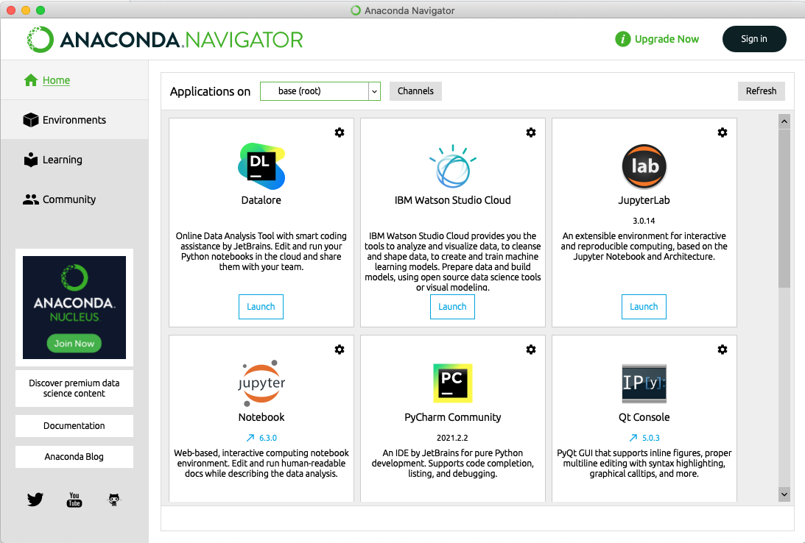

## How to continue to use notebooks after the course?
If you want to continue with the course material once the course is finished you can do one of the following.

#### Continue using pan-learning

Access to jupyterhub should remain open for a few days after the course and you are welcome to continue using it.

#### Local installation
If you prefer to set up a local installation of jupyter notebook or lab you can do the following

1. Download [anaconda](https://www.anaconda.com/products/individual#download-section)

2. Clone the repository with the notebooks by e.g. typing in terminal: *git clone https://github.com/ess-dmsc-dram/python-course-ikon.git*. Another option is to download a zipped folder of the repository. To do so, go to https://github.com/ess-dmsc-dram/python-course-ikon, click on the green *Code* button and choose *Download zip*.

3a. Follow instructions on https://scipp.github.io/getting-started/installation.html 

3b. Open Anaconda Navigator and then click on *Launch* Jupyter notebook or Jupter lab (and then navigate to the folder where you put the repository). 

5. *Optional:*  
   While jupyter basics and python basics should work without any problem, to be able to run other notebooks you will need to access additional packages. This can be done by installing packages in anaconda e.g. by: 
   - typing the following command in a terminal,
      *conda install  -c conda-forge  numpy matplotlib scipy pandas h5py hdf5 scikit-learn ipywidgets ase nglview scipp pythreejs ipympl ipykernel<=6.3.1* 
   - installing these packages (i.e. numpy matplotlib scipy pandas h5py hdf5 scikit-learn ipywidgets ase nglview scipp pythreejs ipympl ipykernel<=6.3.1) from Anaconda Navigator ([online instructions](https://docs.anaconda.com/anaconda/navigator/tutorials/manage-packages/#installing-a-package)).

   Some notebooks might require other packages not available using conda. In this case, please follow the instructions provided in the notebook(s) to install them.
   

