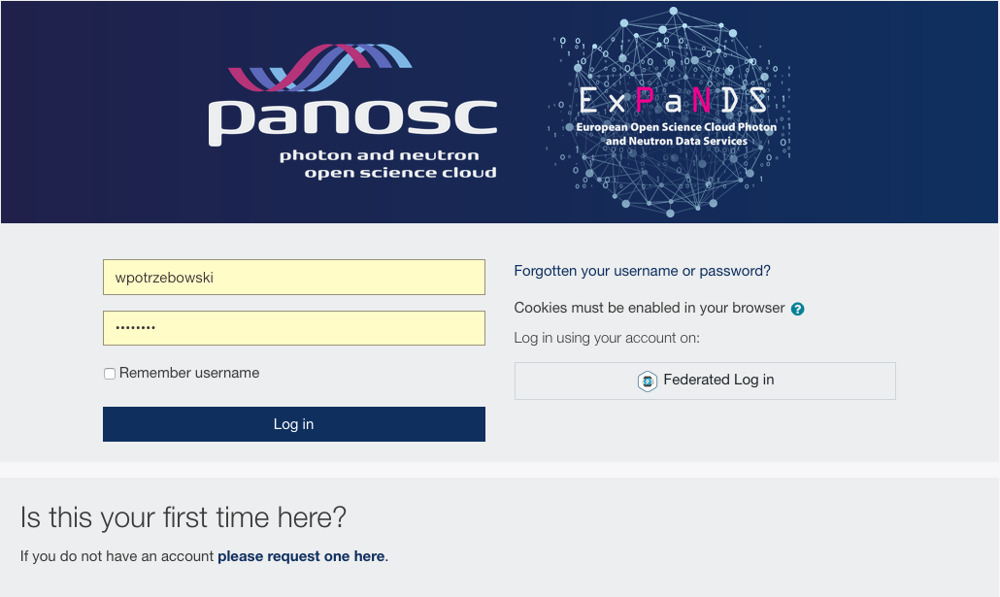
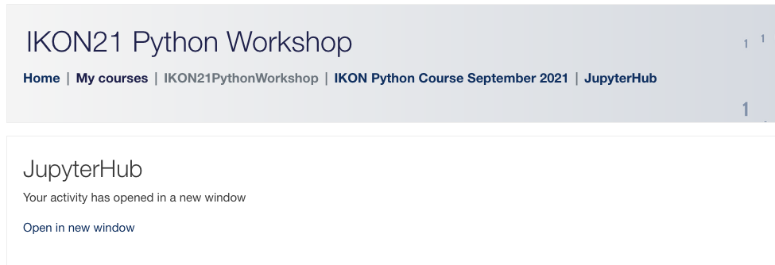
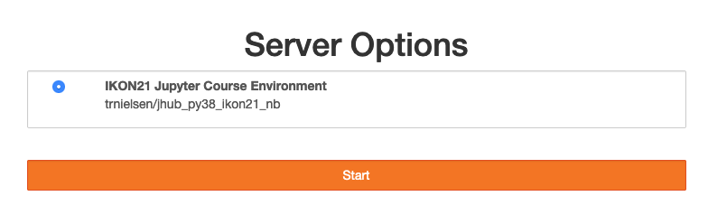

## Welcome to the python training at IKON20

In order to start working on exercises please follow the steps:
1. Copy *https://pan-learning.org/moodle/mod/lti/view.php?id=2071* and paste into your web browser
2. Login using your pan-learning credentials

3. Click on “Open in new window”

4. Click on *Start My Server* button 
5. Click on *Start* button to start the server 

6. Go to *python-course-ikon/notebooks* folder and choose exercises you want to work on
