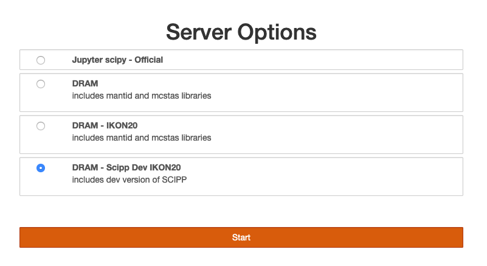

## Welcome to the python training at IKON20

In order to start working on exercises please follow the steps:
1.  Go to https://pan-learning.org/moodle/course/view.php?id=36 
2. Login with the credentials you received in the email from admin@pan-learning.org. 
3. Click on “Jupyterhub (external)”

4. Click on “Start My Server”

5. Choose "DRAM - Scipp Dev IKON20"
