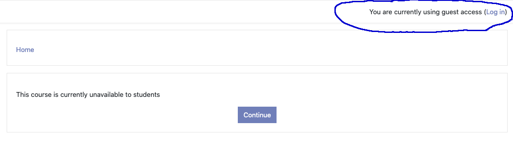
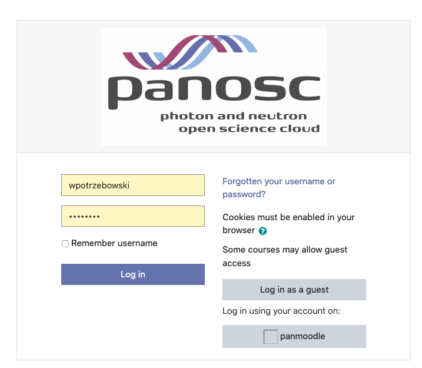
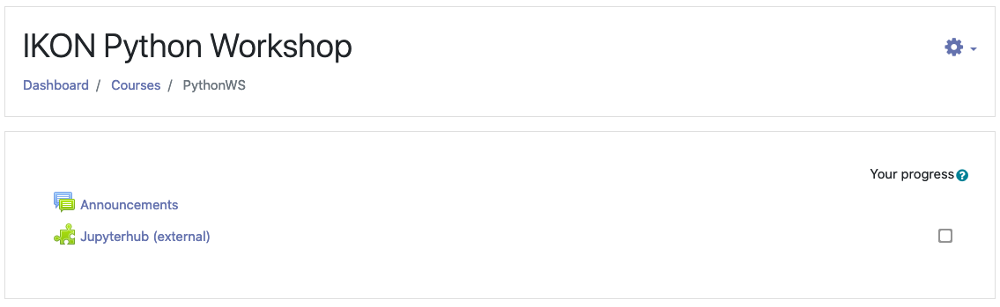
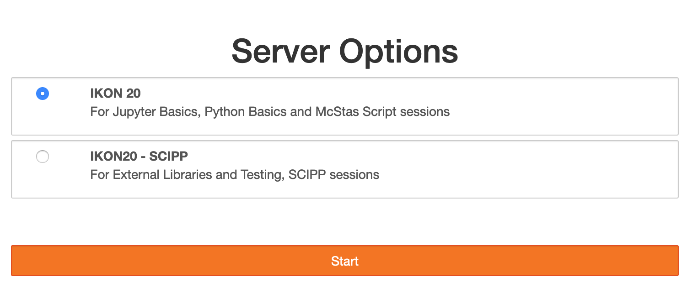
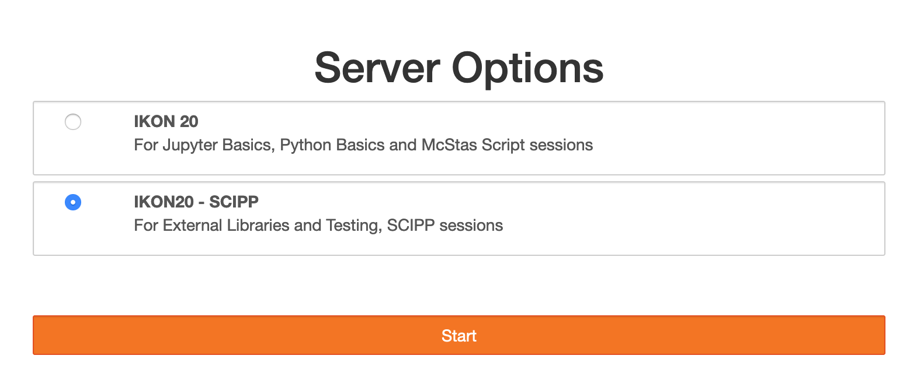

## Welcome to the python training at IKON20

In order to start working on exercises please follow the steps:
1. Copy *https://pan-learning.org/moodle/course/view.php?id=36* and paste into your web browser
2. Login (click on link right upper corner)

with the credentials you received in the email from admin@pan-learning.org.

3. Click on “Jupyterhub (external)”

4. Click on *Start My Server* button 
5a. Choose "IKON20" if you attend Jupyter Basics, Python Basics or McStas Script seession or "IKON20 - SCIPP"

5b. Choose "IKON20 - SCIPP" if you attend Extended Libraries and Testing or Scipp Session 

